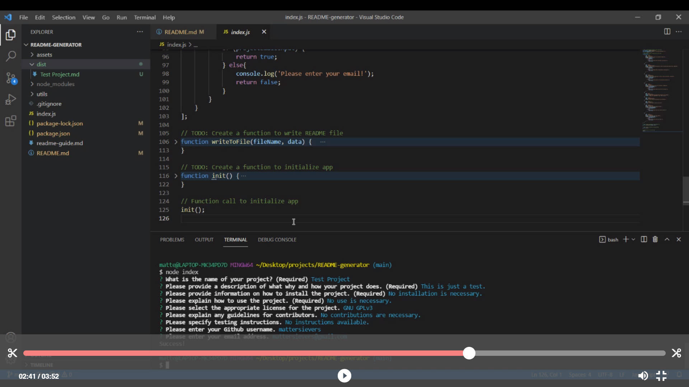

 
  # README

  ## Table of Contents
  * [Description](#description)
  * [Information](#information)
  * [Install](#install)
  * [Use](#use)
  * [License](#license)
  * [Contributing](#contributing)
  * [Tests](#tests)
  * [Questions](#questions)

  ## Description
  This program prompts the user with questions, takes information input by the user, and processes it into a README in markdown format.

  ## Information
  This progam implements Node.js to generate a README file in markdown format.

  ## Install
  Ensure you have the latest Node.js installed. Run the command "npm init" and "npm install inquirer" in the command line of your terminal to install the appropriate packages. Use the command "node index" to initialize the README creation process.
  
  ## Use
  Use the command "node index" and answer the following prompts to generate a README that will be titled after the name of the project and stored in the dist folder.
  
  
  
  ## License
  No license.

  ## Contributing
  

  ## Questions
  - [Github for mattersievers](http://www.github.com/mattersievers)
  - For further questions, contact me through email at mattersievers@gmail.com

